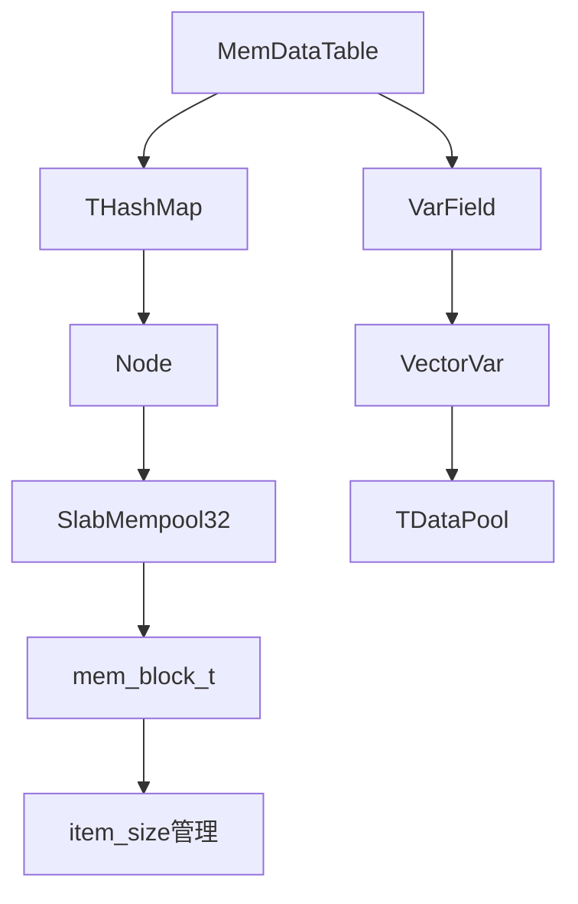

### MemDataTable 底层存储结构实现详解

#### 一、总体架构
`MemDataTable` 作为内存存储引擎，用于存储广告库正排信息，继承自 `DataTable`。其底层存储结构的核心在于通过分层内存管理和哈希表实现高效的数据存储与访问。以下是核心成员变量及其作用：
```cpp
template <class TSchema>
class MemDataTable : public DataTable<TSchema> {
private:
    SlabMempool32* _p_hash_inner_pool;    // 为哈希表节点分配内存的内存池
    DataPool<SlabMempool32>* _p_hash_pool; // 对哈希表内存池进行封装的数据池
    THashMap* _p_dict;                    // 核心哈希表，用于快速查找数据
    TInnerPool* _p_inner_pools[TSchema::VAR_POOL_NUM]; // 存储变长字段的内部内存池数组
    TDataPool* _p_var_pools[TSchema::VAR_POOL_NUM];   // 存储变长字段的数据池数组
};
```
这些成员变量相互协作，构成了 `MemDataTable` 底层存储的基础架构。

#### 二、哈希表实现细节
##### 1. 哈希表节点结构
```cpp
template <class TSchema>
class MemDataTable<TSchema>::THashMap {
public:
    struct Node {
        uint32_t hash;         // 存储键的哈希值，用于快速定位
        uint32_t next;         // 指向下一个节点的索引，用于处理哈希冲突
        TSchema::TInnerTuple data; // 存储实际的数据
    };
};
```
节点包含哈希值、指向下一个节点的索引和实际的数据，通过 `next` 指针将冲突的节点连接成链表，实现链地址法处理哈希冲突。

##### 2. 哈希表内存布局
哈希表使用一个数组存储链表的头节点，每个数组元素对应一个哈希桶。当发生哈希冲突时，新节点会被插入到对应哈希桶的链表中。

##### 3. 哈希冲突处理（链地址法）
```cpp
// 插入操作
template <typename TSchema>
int MemDataTable<TSchema>::insert(const TDataTuple& tuple) {
    if (!DataTable<TSchema>::is_valid_data_tuple(tuple)) {
        CFATAL_LOG(
                "MemDataTable[%s]: data tuple is not valid",
                this->_table_name.c_str());
        return -1;
    }

    TInnerTuple value;
    DataTable<TSchema>::make_inner_tuple(tuple, &value);
    if (is_in(value.primary_key())) {
        StringOstream pk_str;
        pk_str << value.primary_key();
        CFATAL_LOG("pk[%s] is already in MemDataTable[%s]",
                pk_str.get_string().c_str(), this->_table_name.c_str());
        return -1;
    }

    if (insert_var_pools(value, tuple) < 0) {
        CFATAL_LOG(
                "MemDataTable[%s]: failed to insert var pools",
                this->_table_name.c_str());
        return -1;
    }

    typename THashMap::TDataPool::TVaddr vaddr;
    int ret = _p_dict->insert(value, &vaddr);

    if (ret < 0) {
        CFATAL_LOG(
                "MemDataTable[%s]: failed to insert tuple into dict",
                this->_table_name.c_str());
        return -1;
    }

    if (FLAGS_adtable_start_optimize_v1 && this->_adtable_ctx->is_init_load()) {
        // 初始化加载时不触发回调
    } else {
        const_cast<TDataTuple&>(tuple)._set_vaddr(vaddr);
        if (DataTable<TSchema>::trigger_insert(tuple) < 0) {
            CFATAL_LOG(
                    "MemDataTable[%s]: failed to notify the triggers",
                    this->_table_name.c_str());
            return -1;
        }
    }

    return 0;
}
```
插入操作流程如下：
 - 首先验证数据的有效性，若无效则记录错误日志并返回 -1。
 - 将输入的 `TDataTuple` 转换为内部格式 `TInnerTuple`。
 - 检查键是否已存在，若存在则记录错误日志并返回 -1。
 - 插入变长字段，若插入失败则记录错误日志并返回 -1。
 - 调用哈希表的 `insert` 方法插入数据，并获取虚拟地址 `vaddr`。
 - 根据配置决定是否触发回调。

#### 三、内存管理系统
##### 1. SlabMempool32 内存池
```cpp
class SlabMempool32 : public IMemDataPool<uint32_t> {
private:
    struct mem_block_t {
        char* start;          // 内存块的起始地址
        uint32_t item_size;   // 每个内存项的大小
        uint32_t free_item;   // 剩余可用的内存项数量
        uint32_t max_item_num; // 内存块中最大的内存项数量
    };
    std::vector<mem_block_t> _blocks; // 内存块列表
};
```
`SlabMempool32` 将内存划分为多个固定大小的内存块，每个内存块包含多个相同大小的内存项，有助于减少内存碎片。

##### 2. 内存分配策略
```cpp
uint32_t SlabMempool32::malloc(size_t len) {
    int slab_idx = find_slab(len); // 查找合适的 slab
    mem_slab_t& slab = _slabs[slab_idx];
    uint32_t block_idx = malloc_from_freelist(slab);
    if (block_idx == INVALID_BLOCK_IDX) {
        block_idx = malloc_from_new_block(slab, len);
    }
    return make_vaddr(block_idx, offset);
}
```
内存分配时，先根据所需内存大小找到合适的 `slab`，尝试从 `slab` 的空闲链表中分配内存。若空闲链表为空，则创建新的内存块。最后通过 `make_vaddr` 方法生成虚拟地址。

##### 3. 虚拟地址的生成与使用
```cpp
// 生成虚拟地址
uint32_t SlabMempool32::make_vaddr(uint32_t block_idx, uint32_t offset) {
    return (block_idx << _idx2_bits) | offset;
}

// 解析虚拟地址
inline void SlabMempool32::split_vaddr(
        const TVaddr& vaddr,
        uint32_t& block_idx,
        uint32_t& offset) const {
    block_idx = vaddr >> _idx2_bits;
    offset = vaddr & _idx2_mask;
}
```
虚拟地址是一个 32 位无符号整数，通过将 `block_idx` 左移 `_idx2_bits` 位，再与 `offset` 按位或运算生成。在使用时，通过 `split_vaddr` 方法将虚拟地址解析为 `block_idx` 和 `offset`，从而定位到实际的内存位置。

##### 4. 内存回收机制
```cpp
int SlabMempool32::free(const TVaddr& vaddr) {
    uint32_t block_idx, offset;
    split_vaddr(vaddr, block_idx, offset);
    mem_block_t& block = _blocks[block_idx];
    char* addr = block.start + offset * block.item_size;
    *(uint32_t*)addr = slab_idx; // 标记为空闲
    return 0;
}
```
回收内存时，先解析虚拟地址得到 `block_idx` 和 `offset`，然后将对应的内存项标记为空闲。

#### 四、变长字段存储
##### 1. VarField 结构
```cpp
template <typename TSchema>
class VarField {
protected:
    TSchema::THead _head;      // 字段的头部信息，通常包含长度等信息
    const char* _p_body;       // 字段的数据体
    TSchema::TTail _tail;      // 字段的尾部信息，可用于校验等
    bool _is_valid;            // 字段的有效性标志
};
```
`VarField` 用于存储变长字段，通过头部、数据体和尾部信息管理变长数据。

##### 2. 变长数组实现
```cpp
template <typename T, int MAX_SIZE>
class VectorVar : public VarField<VectorVarS<T, MAX_SIZE>> {
public:
    const T& operator[](uint32_t k) const {
        const char* raw_buf = TBase::body();
        uint16_t size = TBase::head();
        if (k >= size) {
            if (size > 0) {
                k = size - 1;
            } else {
                k = 0;
            }
        }
        const T* buf = (const T*) raw_buf;
        return buf[k];
    }
};
```
`VectorVar` 是变长数组的实现，继承自 `VarField`，通过重载 `[]` 运算符访问数组元素。

##### 3. 存储流程
```cpp
template <typename TSchema>
int MemDataTable<TSchema>::insert_var_pools(
        TInnerTuple& inner_tuple,
        const TDataTuple& tuple)
{
    for (size_t pool_idx = 0;
            pool_idx < TSchema::VAR_POOL_NUM;
            ++pool_idx) {
        // 假设这里有处理变长字段的逻辑
        // 例如将 tuple 中的变长字段数据存储到 inner_tuple 对应的位置
    }
    return 0;
}
```
插入变长字段时，遍历每个变长字段数据池，将 `TDataTuple` 中的变长字段数据存储到 `TInnerTuple` 对应的位置。

#### 五、关键数据结构关系

从关系图可以看出，`MemDataTable` 依赖 `THashMap` 存储数据，`THashMap` 的节点使用 `SlabMempool32` 分配内存。同时，`MemDataTable` 管理变长字段，通过 `VarField` 和 `VectorVar` 存储，使用 `TDataPool` 进行内存管理。

#### 六、性能优化点
##### 1. 内存池分层设计
哈希表节点和变长字段分别使用不同的内存池管理，减少了内存碎片。哈希表节点使用 `SlabMempool32` 进行固定大小的内存分配，变长字段使用独立的数据池。
```cpp
uint32_t slabs[] = {4, THashMap::node_size()};
_p_hash_inner_pool->create(slabs, 2, 1024*1024);
```

##### 2. 预分配机制
初始化时预分配一定数量的内存块，减少运行时的内存分配开销。当内存不足时，按需扩展内存块。
```cpp
if (_p_hash_pool->create(_p_hash_inner_pool) < 0) {
    CFATAL_LOG(
            "MemDataTable[%s]: Failed to create the data pool for hashmap",
            this->_table_name.c_str());
    return -1;
}
```

##### 3. 零拷贝技术
使用 `Buffer` 直接操作内存块，避免数据复制，提高数据读写效率。
```cpp
Buffer buf = src_data.raw_buf();
*p_buf = buf.start();
```

#### 七、典型操作流程
##### 插入操作
```cpp
template <typename TSchema>
int MemDataTable<TSchema>::insert(const TDataTuple& tuple) {
    // 验证数据有效性
    if (!DataTable<TSchema>::is_valid_data_tuple(tuple)) {
        CFATAL_LOG(
                "MemDataTable[%s]: data tuple is not valid",
                this->_table_name.c_str());
        return -1;
    }
    // 转换为内部格式
    TInnerTuple value;
    DataTable<TSchema>::make_inner_tuple(tuple, &value);
    // 检查键是否已存在
    if (is_in(value.primary_key())) {
        StringOstream pk_str;
        pk_str << value.primary_key();
        CFATAL_LOG("pk[%s] is already in MemDataTable[%s]",
                pk_str.get_string().c_str(), this->_table_name.c_str());
        return -1;
    }
    // 插入变长字段
    if (insert_var_pools(value, tuple) < 0) {
        CFATAL_LOG(
                "MemDataTable[%s]: failed to insert var pools",
                this->_table_name.c_str());
        return -1;
    }
    // 插入到哈希表
    typename THashMap::TDataPool::TVaddr vaddr;
    int ret = _p_dict->insert(value, &vaddr);
    if (ret < 0) {
        CFATAL_LOG(
                "MemDataTable[%s]: failed to insert tuple into dict",
                this->_table_name.c_str());
        return -1;
    }
    // 根据配置决定是否触发回调
    if (FLAGS_adtable_start_optimize_v1 && this->_adtable_ctx->is_init_load()) {
        // 初始化加载时不触发回调
    } else {
        const_cast<TDataTuple&>(tuple)._set_vaddr(vaddr);
        if (DataTable<TSchema>::trigger_insert(tuple) < 0) {
            CFATAL_LOG(
                    "MemDataTable[%s]: failed to notify the triggers",
                    this->_table_name.c_str());
            return -1;
        }
    }
    return 0;
}
```
插入操作先验证数据有效性，转换为内部格式，检查键是否已存在，插入变长字段，再插入到哈希表，最后根据配置决定是否触发回调。

##### 查询操作
```cpp
template <typename TSchema>
typename DataTable<TSchema>::Iterator
MemDataTable<TSchema>::seek(TPrimaryKey const& pk) const {
    const typename THashMap::Iterator& iter = _p_dict->seek(pk);
    const TInnerTuple* p_tuple = (iter.is_null()? NULL: &(*iter));
    return typename DataTable<TSchema>::Iterator(this, p_tuple, iter.vaddr());
}
```
查询操作通过哈希表的 `seek` 方法查找键对应的节点，若找到则返回对应的迭代器。

#### 八、总结
`MemDataTable` 通过分层内存管理、哈希表优化和变长字段处理，实现了高效的内存型广告数据存储。其优势在于内存池技术减少了内存碎片，链地址法处理哈希冲突保证了性能，变长字段独立存储提高了扩展性，预分配和批量操作提升了性能，适用于大规模广告数据的实时查询和更新场景。 
